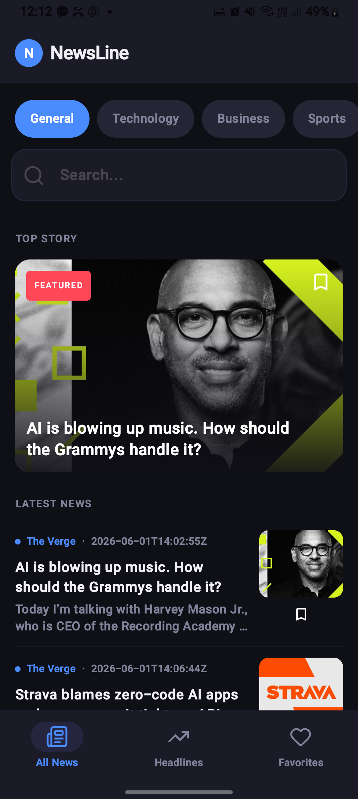
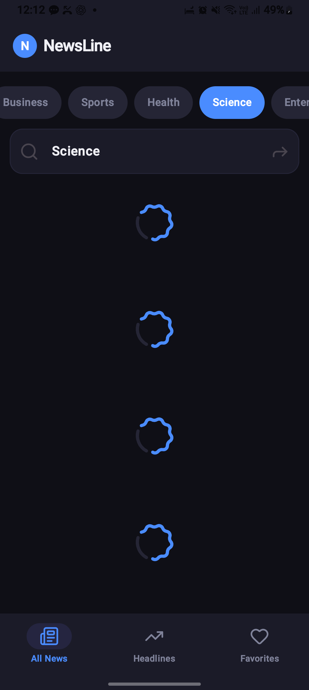
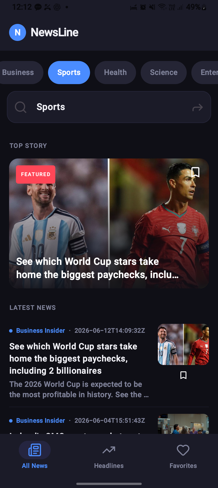
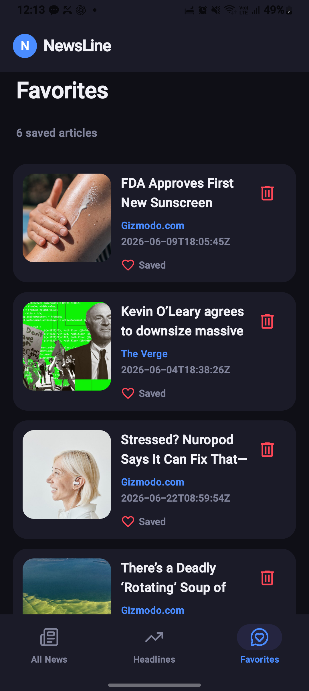
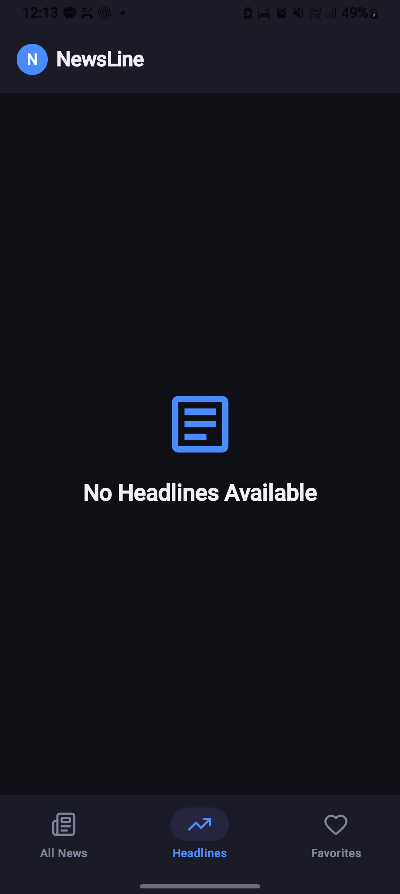
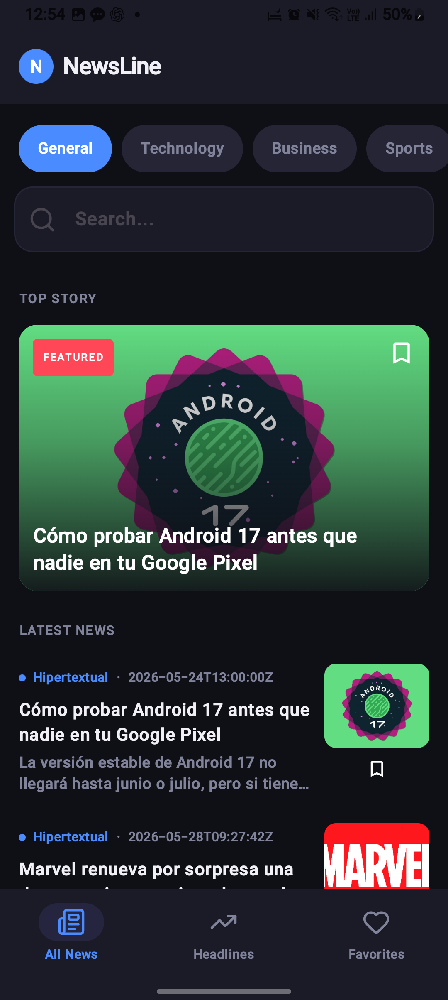
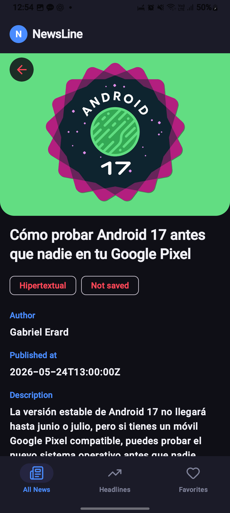

# NewsCMP - Compose Multiplatform News App

NewsCMP is a modern, cross-platform news application built with **Compose Multiplatform**. It provides a seamless news-reading experience across Android and iOS, leveraging a shared codebase for UI and business logic.


## 📸 Screenshots

<p align="center">
  
  
  
</p>
<p align="center">
  
  
  
</p>
<p align="center">
  
  
  
</p>
## 🚀 Features

- **Top Headlines**: Stay updated with the latest news from various categories.
- **Category Filtering**: Filter news based on interests (Business, Tech, etc.).
- **Search**: Find specific articles by keywords.
- **Details Screen**: View detailed information about a specific news article.
- **Favorites**: Save articles to a local database using **Room** for offline access.
- **Responsive UI**: Custom components like `FeaturedCard`, `HeroHeadlineCard`, and `ArticleListItem`.
- **Cross-Platform**: Unified logic and UI components across Android and iOS.

## 🛠 Tech Stack

- **UI Framework**: [Compose Multiplatform](https://www.jetbrains.com/lp/compose-multiplatform/)
- **Networking**: [Ktor](https://ktor.io/) with custom `AuthPlugin` for API key management.
- **Local Database**: [Room](https://developer.android.com/training/data-storage/room) (Multiplatform) for persistent storage.
- **Dependency Injection**: [Metro](https://github.com/vimalansel/metro) for compile-time safe DI.
- **Navigation**: [Jetpack Navigation 3](https://developer.android.com/guide/navigation) for multiplatform routing.
- **Image Loading**: [Coil 3](https://coil-kt.github.io/coil/) for asynchronous image loading.
- **Serialization**: [Kotlinx Serialization](https://github.com/Kotlin/kotlinx.serialization) for JSON handling.
- **Logging**: [Kermit](https://github.com/touchlab/Kermit) for multiplatform logging.

## 🏗 Architecture

The project follows **Clean Architecture** principles and the **MVVM** (Model-View-ViewModel) pattern:

- **Data Layer**: Handles API requests (Ktor) and local persistence (Room).
- **Domain Layer**: Contains pure business logic and **Use Cases** (e.g., `GetHeadlinesUseCase`, `AddToFavoriteUseCase`).
- **Presentation Layer**: Built with Compose Multiplatform, organized by screens (Headlines, Search, Favorites, Details) and reusable UI components.

## 📂 Project Structure

- **`shared`**: The core of the application.
  - `commonMain`: Shared UI, Use Cases, Repositories, and DI logic.
  - `androidMain`: Android-specific implementations (e.g., Database initialization).
  - `iosMain`: iOS-specific implementations and native integration.
- **`androidApp`**: Android application entry point.
- **`iosApp`**: iOS application entry point (Xcode project).

## ⚙️ Setup Instructions

### Prerequisites

- Android Studio (Ladybug or later)
- Xcode (for iOS development)
- A NewsAPI key from [NewsAPI.org](https://newsapi.org/)

### Getting Started

1. **Clone the repository**:
   ```bash
   git clone https://github.com/yourusername/NewsCMP.git
   cd NewsCMP
   ```

2. **Add your API Key**:
   The API key is managed via `AuthPlugin.kt`. Open [AuthPlugin.kt](file:///home/wahid/AndroidStudioProjects/NewsCMP/shared/src/commonMain/kotlin/com/wahid/newscmp/utils/AuthPlugin.kt) and update the `apiKey` value:
   ```kotlin
   val AuthPlugin = createClientPlugin("authPlugin"){
       onRequest { request, content ->
           request.url.parameters.append("apiKey", "YOUR_API_KEY_HERE")
       }
   }
   ```

3. **Build and Run**:
   - For Android: Run the `androidApp` configuration.
   - For iOS: Open `iosApp/iosApp.xcworkspace` in Xcode or run from Android Studio using the Kotlin Multiplatform Mobile plugin.

## 🤖 CI/CD

The project includes GitHub Actions workflows for automated builds:
- `android.yml`: Android build and tests.
- `ios.yml`: iOS build and framework generation.
- `build.yml`: General multiplatform build check.


## 🎬 Demo

Check out the app in action:

[Watch the demo video](screenshots/newsAppDemo.mp4)

## 📄 License

This project is licensed under the MIT License.
